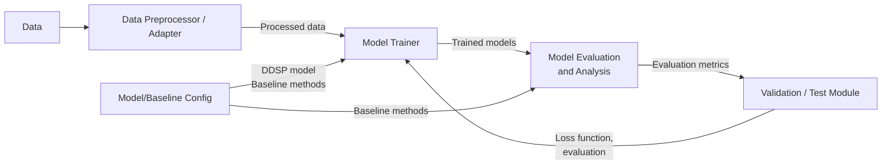

# **Nam Khanh’s Technical Plan — DDSP Timbre Transfer Evaluation Project**

**Name:** Thieu Nam Khanh  
**Student Number:** 101221568  
**Degree Program:** Digital Systems and Design  
**Project Topic:** Evaluating Differentiable Digital Signal Processing (DDSP)  
**Supervisor:** Filip Elvander

---

# **1\. Introduction**

Differentiable Digital Signal Processing (DDSP), a framework developed at Google, introduces a hybrid approach that utilizes classical DSP principles and strengths, all while taking advantage of neural networks’ pattern learning ability.

Traditional DSP requires extensive domain knowledge and hand-tuned parameters to obtain the desired result. A more recent approach, neural networks, generates an audio signal in the time domain, frequency domain suffers from bias due to the generation process. Another generation process creates an audio signal by waveform samples, avoiding those issues, but the network becomes much more data-hungry and does not take into account the bias over oscillations and perceptual losses. Rather than generating audio purely from waveform models, DDSP leverages differentiable oscillators, filters, and synthesis architectures to create interpretable, controllable sound generation systems.

This project focuses exclusively on evaluating DDSP for **timbre transfer**, a task where the pitch and loudness contours from a source (e.g., voice or an instrument) are preserved while the timbre is transformed to match a target instrument. It is worth mentioning that, due to the way that the model resynthesizes signals, the framework presented in the paper can also perform denoising and dereverberation tasks to some extent.  

---

# **2\. Tasks**

### **1\. Data Preparation**

* Identify and collect appropriate datasets for the project.  
* Clean, segment, and organize audio data.  
* Prepare training, validation, and test splits.

### **2\. Preprocessing & Data Adaptation**

* Establish a consistent preprocessing workflow for all audio sources.  
* Extract necessary conditioning information (e.g., pitch, loudness).  
* Ensure compatibility with both baseline and DDSP models.

### **3\. Baseline & Model Setup**

* Select and define the baseline method for comparison.  
* Configure the DDSP timbre-transfer model.  
* Set up a unified configuration and logging strategy for experiments.

### **4\. Model Training**

* Train the DDSP model under the prepared pipeline.  
* Generate baseline outputs where required.  
* Record training progress, outputs, and relevant artifacts.

### **5\. Evaluation & Analysis**

* Conduct objective evaluations on test data.  
* Compare the performance of DDSP with that of baseline methods.  
* Perform limited subjective listening assessments.  
* Summarize the findings and reflect on the strengths, limitations, and key insights.

### **6\. Reporting & Documentation**

* Compile results into figures, tables, and descriptions.  
* Document methodology, observations, and conclusions.  
* Finalize project report or presentation materials.

As there will be more development tasks in the future, the schedule is tentative, and the next task will be agreed upon at the bi-weekly meetings with the advisor.

# **3\. Timeline**

| Event | Time Period | Task Description |
| ----- | ----- | ----- |
| **Project start** | 7/11 – 24/11 | Create a project plan, technical plan, and perform a literature review |
| **Implementation (Phase 1\)** | 25/11 – 13/12 | Initial DDSP model setup, dataset processing, baseline preparation |
| **Implementation (Phase 2\)** | 6/1 – 31/1 | Core DDSP training, timbre transfer experiments, and interim evaluations |
| **Buffer / Adjustment Phase** | 1/2 – 15/2 | Fix issues, expand experiments, and refine the evaluation pipeline |
| **Final Implementation Sprint** | 23/2 – 1/3 | Final experiments, listening tests, documentation, and polishing |
| **Project end** | 2/3/2026 | Final submission deadline |

117 total project days, 94 potential working days (minus exam week & personal off-days)

---

# **5\. Expected Outcome**

The expected outcome of this project is a **systematic evaluation** of the DDSP framework for the task of **timbre transfer**. Concretely, the project will deliver:

* A working **timbre transfer pipeline** based on DDSP (source → target instrument) that can be expanded to evaluate different models.  
* One or more **baseline systems** for comparison.  
* A set of **objective metrics** (e.g., MCD, f₀ RMSE, loudness RMSE, basic runtime/latency) calculated on a defined test set.  
* A documented **codebase and configuration files** enabling reproducible experiments.  
* A **final written report** that describes the methodology, experiments, and conclusions.

The primary result is *not* a new algorithm, but a clear and well-argued evaluation of DDSP timbre transfer performance under realistic conditions.

---

# **6\. Project Management and Coordination**

* **Progress tracking:**  
  * Maintain a short weekly log summarizing what was done, what problems arose, and what is planned next.  
* **Coordination with supervisor:**  
  * Regular check-ins bi-weekly to review progress, discuss risks, and adjust scope if necessary.  
* **Version control and experiments:**  
  * Use Git for all code and configuration files.  
  * Tag important experiment milestones.
